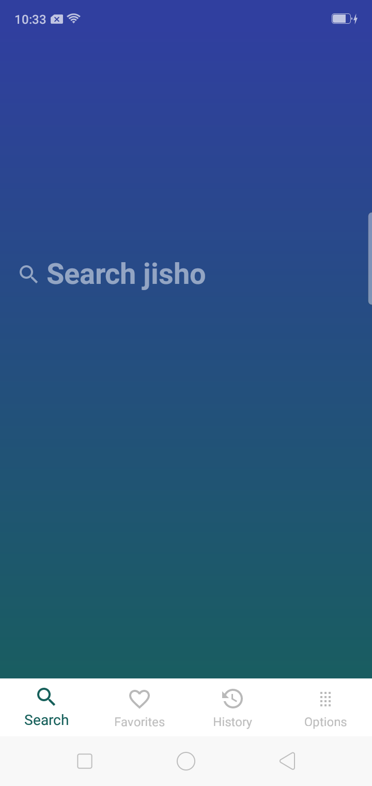
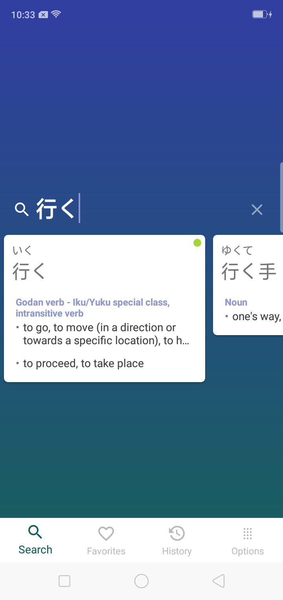
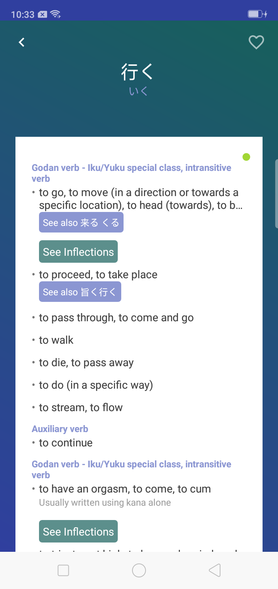
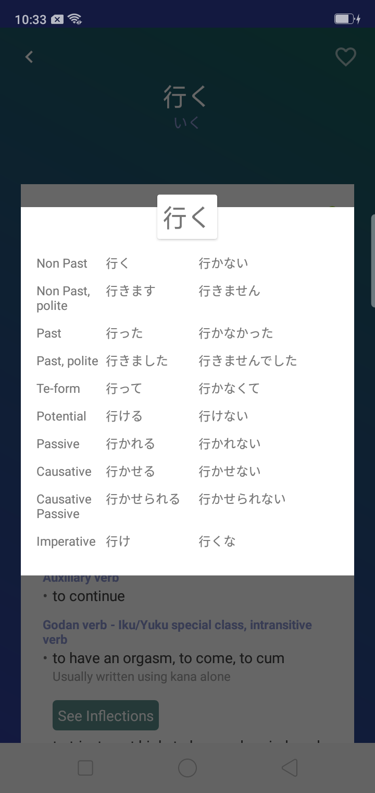

# Mobile-Jisho

Jisho is the best companion one can ever ask for when it comes to learning Japanese. Just to add an element of convenience of to Jisho, is the Mobile-Jisho. Now search Jisho with the convenience of your Android Device.

            

### Features:
 * Jisho at the convenience of your Handheld device anytime, anywhere.
 * Save your favorites and check them anytime for reference.
 * Check your search history too!
 
### Roadmap ahead:
- Providing complete offline support. Currently it has a lot of bugs
- Introducing Anki-like flashcard memorisation system

Credits:
---------------------
Jisho API.

# 頑張りましょう！
